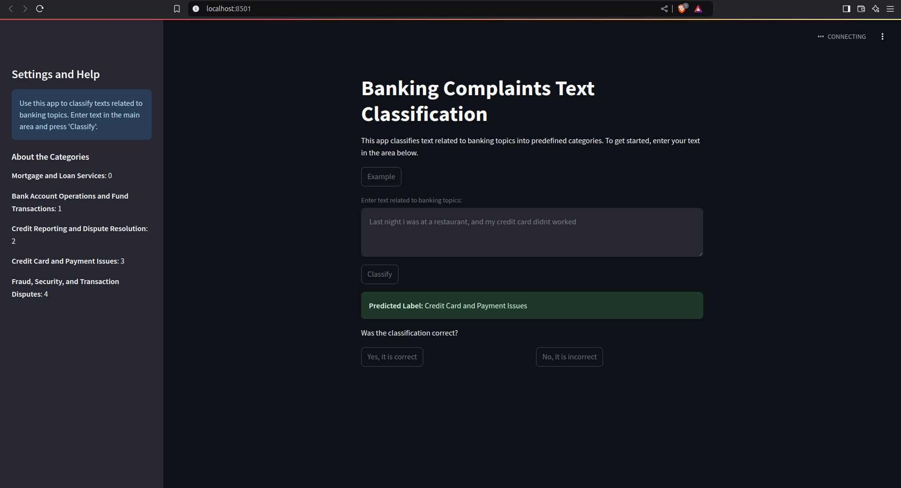

# Proyecto de Procesamiento de Texto de quejas bancarias con Spark NLP

Este proyecto utiliza Spark NLP para el procesamiento y análisis de texto de quejas bancarias. A continuación, se describe la estructura y los componentes del proyecto.

---

## Estructura del Proyecto

El proyecto se organiza en los siguientes directorios y archivos:

- **`/app`**: Contiene la aplicación en Streamlit y el código principal.
  - **`requirements.txt`**: Dependencias necesarias para ejecutar la aplicación en un contenedor Docker.
  - **`models`**: Modelos entrenados, incluyendo CountVectorizer, IDF, LDA, LogisticRegression y DecisionTree.
  - **`Dockerfile`**: Configuración para generar el contenedor a partir del repositorio clonado.
- **`/config/`**: Archivos de configuración para EMR.
- **`/sparknlp-complaints`**: Notebooks de Jupyter que contienen análisis, creación de funciones, y pipelines de Spark NLP. Incluye el uso de MlFlow para el seguimiento de modelos.
  - **`mlruns`**: Registro de experimentos y modelos en MlFlow.

---

## Componentes del Proyecto

1. **CountVectorizer**: Representa textos en una matriz de frecuencias de tokens.
2. **IDF**: Ajusta la frecuencia de tokens, reduciendo la importancia de palabras comunes.
3. **LDA**: Agrupa documentos en tópicos basados en la frecuencia de tokens.
4. **Logistic Regression**: Clasificación supervisada para predecir categorías de texto.
5. **DecisionTreeClassifier**: Clasificación mediante árbol de decisiones basado en contenido.
6. **Notebook de Jupyter**: Ejemplo interactivo del uso de Spark NLP.

---

## Resultados

### Asignación de Etiquetas

#### Modelos de Tópicos (LDA)

- **Tema 0: Hipotecas y Bienes Raíces**  
  - Términos predominantes: `['loan', 'mortgage', 'home', 'modification', 'property', 'payment']`
  - Categoría: "Préstamos Hipotecarios y Propiedades"

- **Tema 1: Operaciones Bancarias y Transacciones**  
  - Términos predominantes: `['check', 'deposit', 'fund', 'account', 'branch', 'bank']`
  - Categoría: "Operaciones Bancarias y Sucursales"

- **Tema 2: Informes de Crédito y Disputas**  
  - Términos predominantes: `['report', 'credit', 'inquiry', 'dispute', 'consumer']`
  - Categoría: "Reportes de Crédito y Protección del Consumidor"

- **Tema 3: Tarjetas de Crédito y Cargos de Intereses**  
  - Términos predominantes: `['payment', 'fee', 'balance', 'card', 'account']`
  - Categoría: "Tarjetas de Crédito y Cargos Financieros"

- **Tema 4: Fraude y Disputas de Transacciones**  
  - Términos predominantes: `['charge', 'fraud', 'transaction', 'claim', 'card']`
  - Categoría: "Fraude y Disputas de Transacciones"

---

### Predicción de Etiquetas

Se utilizaron los siguientes modelos para la prediccion de nuevas etiquetas.

- **Logistic Regression**
  - Test Set Accuracy = 0.799
  - Test Set F1 Score = 0.799

- **Decision Tree**
  - Test Set Accuracy = 0.539
  - Test Set F1 Score = 0.538

El modelo de **Logistic Regression** fue seleccionado para la aplicación.

---

## Requisitos

### Software

Para ejecutar el proyecto, se requieren las siguientes aplicaciones:

* Docker

Para ejecutar los notebooks en un entorno diferente como Amazon EMR o Ubuntu, se deben tener las siguientes dependencias y paquetes:

* Spark 3.3.1
* Spark NLP 5.5.0
* Python 3.8
* Java 8 o 11
* JupyerHub o Notebook interactivo
* MlFlow

### Hardware

#### Aplicacion
##### Windows o Ubuntu
* Procesador = 4 cores min
* Ram = 8gb.
* Espacio en disco = 3gb

#### Notebook

##### EMR
* Cluster MX5.large con 1 ejecutor y 1 core.
##### Ubuntu
* Procesador = 4 cores min
* Ram = 16gb (recomendado 32gb).
* Espacio en disco = 5gb

## Vista de la aplicación

